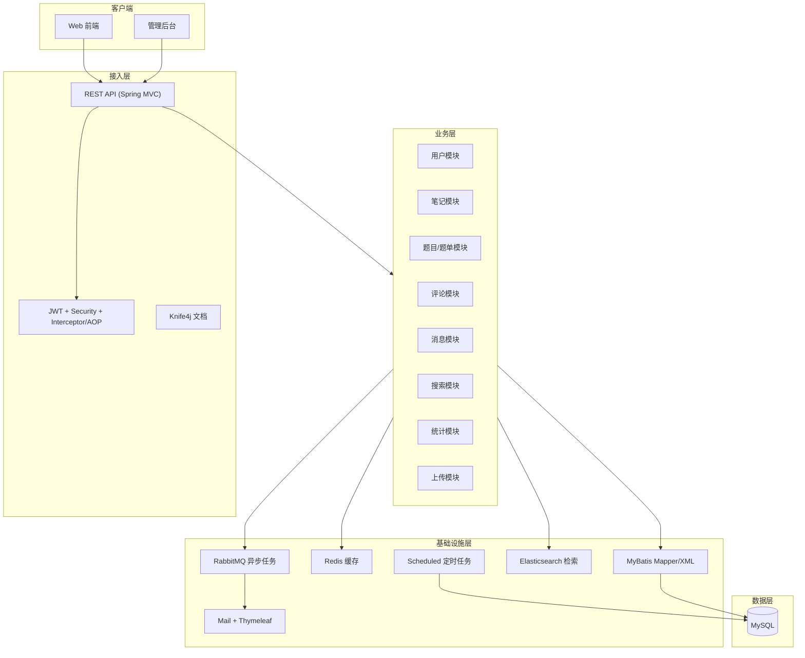

<div align="center">

# Note Community Backend

一个面向学习场景的笔记社区后端服务，提供用户、笔记、题目、评论、消息、搜索与统计等核心能力。


</div>

---

## 项目介绍

Note Community Backend 是一个基于 Spring Boot 的 RESTful API 服务，面向“题目练习 + 笔记沉淀 + 社区互动”场景设计。
系统支持账号/邮箱登录、笔记发布与互动、题库与题单管理、消息通知、全文搜索与运营统计，适用于学习社区或知识平台后端建设。

---

## 技术栈

| 类别 | 技术 | 说明 |
|---|---|---|
| 语言与框架 |   | 应用基础框架 |
| 安全认证 |   | 认证与鉴权 |
| 数据访问 |  | ORM / SQL 映射 |
| 数据存储 |   | 持久化与缓存 |
| 搜索引擎 |  | 笔记/用户搜索 |
| 消息队列 |  | 异步邮件任务 |
| 文档与日志 |   | 接口文档与日志治理 |
| 其他组件 |  | 邮件模板渲染 |

---

## 系统架构图



---

## 核心功能

- 用户体系：注册、登录、自动登录、个人资料维护、头像上传。
- 笔记体系：笔记发布/编辑/删除、点赞、收藏、排行榜与热力图。
- 题库体系：题目查询、分类管理、题单管理、完成状态追踪。
- 社区互动：评论、回复、消息通知、未读管理。
- 搜索能力：基于 Elasticsearch 的笔记与用户检索（含高亮）。
- 运营统计：定时汇总登录、注册、笔记提交等核心指标。
- 邮件服务：验证码发送、频率限制、异步投递（RabbitMQ）。

---

## 环境要求

- JDK 17+
- Maven 3.6+
- MySQL 8.0+
- Redis 6.0+
- RabbitMQ 3.8+
- Elasticsearch 7.x

---

## 快速开始

### 1) 克隆项目

```bash
git clone https://github.com/roocl/note-backend.git
cd note-backend
```

### 2) 配置数据库与环境

- 在 MySQL 中创建数据库（例如 `kamanote_tech`）。
- 修改 `src/main/resources/application-dev.yaml` 中的数据源配置。
- 根据本地环境调整 `src/main/resources/application.yaml` 中 Redis、RabbitMQ、Elasticsearch、邮件配置。

### 3) 启动依赖服务

- 启动 MySQL
- 启动 Redis
- 启动 RabbitMQ
- 启动 Elasticsearch

### 4) 构建与运行

```bash
mvn clean compile
mvn spring-boot:run
```

### 5) 访问地址

- 服务地址：`http://localhost:8080`
- API 文档：`http://localhost:8080/doc.html`
