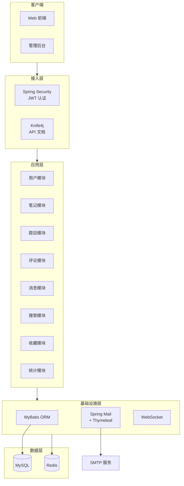

<div align="center">

# 📝 Note Community Backend

**一个功能完善的笔记社区后端服务**

基于 Spring Boot 构建的 RESTful API 服务，提供用户管理、笔记发布、题目练习、评论互动、消息通知等完整功能。


</div>

---

## 📖 项目介绍

Note Community 是一个面向学习者的笔记分享社区后端系统，用户可以围绕题目撰写与分享笔记、进行评论互动、管理个人收藏，并通过题单系统进行针对性练习。系统同时提供管理后台接口，支持题目管理、用户管理和数据统计。

## 🏗️ 系统架构



## ✨ 核心功能

| 模块 | 功能 | 说明 |
|------|------|------|
| 👤 **用户** | 注册 / 登录 / 信息管理 | 支持账号 + 邮箱登录，JWT 无状态认证 |
| 📝 **笔记** | 发布 / 编辑 / 删除 / 排行 | 按题目撰写笔记，支持点赞、收藏、热力图 |
| 📚 **题目** | CRUD / 搜索 / 分类 | 按分类、难度管理题目，支持关键词搜索 |
| 📋 **题单** | 创建 / 排序 / 管理 | 自定义题单，支持题目排序和完成状态追踪 |
| 💬 **评论** | 发布 / 回复 / 点赞 | 支持多级回复和评论点赞 |
| 📬 **消息** | 通知 / 已读 / 批量操作 | 系统消息推送，支持按类型筛选 |
| 📂 **收藏** | 创建收藏夹 / 批量管理 | 将笔记分组收藏，支持批量操作 |
| 📊 **统计** | 数据看板 | 登录、注册、笔记提交等核心指标统计 |
| 📧 **邮件** | 验证码 | 基于 Thymeleaf 模板的邮件验证码 |
| 🔍 **搜索** | 笔记 / 用户搜索 | 支持关键词和标签搜索 |

## 📁 项目结构

```
src/main/java/org/notes/
├── config/          # 配置类 (Security, Knife4j, Redis, WebSocket...)
├── controller/      # 控制层 (15 个 Controller)
├── service/         # 业务逻辑层
├── mapper/          # MyBatis Mapper 接口
├── model/
│   ├── base/        # 通用响应模型 (ApiResponse, Pagination...)
│   ├── dto/         # 请求参数对象 (29 个 DTO)
│   ├── entity/      # 数据库实体类 (13 个 Entity)
│   └── vo/          # 视图返回对象 (27 个 VO)
├── annotation/      # 自定义注解 (@NeedLogin...)
├── interceptor/     # 拦截器
├── filter/          # 过滤器 (JWT)
├── handler/         # 全局异常处理
└── utils/           # 工具类
```

## 🚀 快速开始

### 环境要求

| 依赖 | 版本 |
|------|------|
| JDK | 17+ |
| Maven | 3.6+ |
| MySQL | 8.0+ |
| Redis | 6.0+ |

### 1. 克隆项目

```bash
git clone https://github.com/roocl/note-backend.git
cd note-backend
```

### 2. 配置数据库

创建 MySQL 数据库，并在 `src/main/resources/application-dev.yaml` 中配置连接信息：

```yaml
spring:
  datasource:
    url: jdbc:mysql://localhost:3306/your_database?useSSL=false&serverTimezone=UTC
    username: your_username
    password: your_password
```

### 3. 配置 Redis

确保 Redis 服务已启动（默认 `localhost:6379`）。

### 4. 构建并运行

```bash
# 编译
mvn clean compile

# 运行
mvn spring-boot:run
```

### 5. 访问服务

| 地址 | 说明 |
|------|------|
| `http://localhost:8080` | API 服务 |
| `http://localhost:8080/doc.html` | Knife4j API 文档 |

## 🛠️ 技术栈

| 类别 | 技术 | 用途 |
|------|------|------|
| **框架** | Spring Boot 2.7.18 | 应用基础框架 |
| **安全** | Spring Security + JWT | 认证与授权 |
| **ORM** | MyBatis 2.2.0 | 数据库访问 |
| **数据库** | MySQL 8.0 | 持久化存储 |
| **缓存** | Redis | 验证码缓存、会话管理 |
| **文档** | Knife4j 4.5.0 | 在线 API 文档 |
| **日志** | Log4j2 | 日志管理 |
| **模板** | Thymeleaf | 邮件模板渲染 |
| **实时通信** | WebSocket | 消息推送 |
| **工具** | Lombok / Hutool / Jackson | 开发效率工具 |

