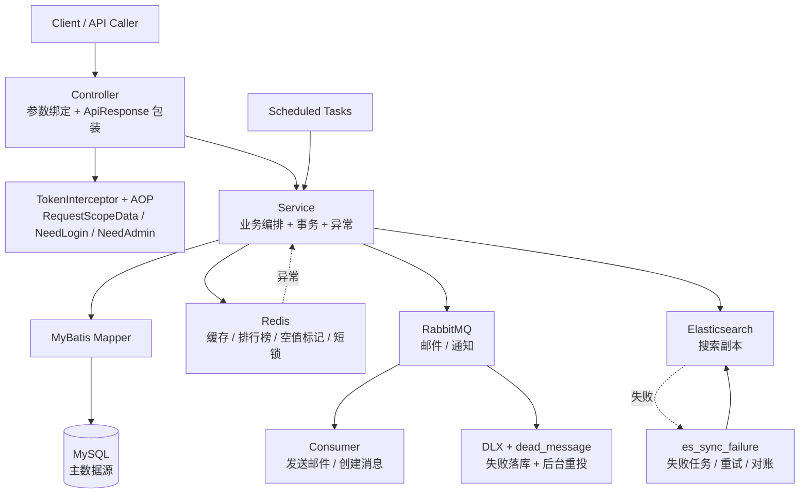

<div align="center">

# Note Community Backend


</div>

## 项目定位

Note Community Backend 是一个基于 Spring Boot 的 RESTful API 服务，面向“题目练习 + 笔记沉淀 + 社区互动”场景设计。
系统支持账号/邮箱登录、笔记发布与互动、题库与题单管理、消息通知、全文搜索与运营统计，适用于学习社区或知识平台后端建设。

## 核心亮点

| 方向 | 设计 |
|---|---|
| 认证鉴权 | JWT + `TokenInterceptor` 解析用户身份，`RequestScopeData` 保存请求上下文，`@NeedLogin` / `@NeedAdmin` 通过 AOP 校验权限 |
| 统一响应与异常 | Controller 统一返回 `ApiResponse` / `PaginationApiResponse` / `TokenApiResponse`，Service 抛语义化异常，由 `GlobalExceptionHandler` 统一处理 |
| Redis 缓存治理 | Spring Cache 缓存笔记/用户，Redis 异常降级；空值标记防穿透，TTL 随机抖动防雪崩，排行榜重建锁防击穿 |
| RabbitMQ 可靠性 | 邮件和通知异步化，事务提交后发送消息；业务队列配置 DLX，死信落库，支持后台查询、删除、手动重投 |
| Elasticsearch 最终一致性 | ES 作为搜索副本，写失败落入 `es_sync_failure`；定时重试、手动重试、MySQL/ES 补偿式对账统一收敛到同一条链路 |
| 搜索能力 | 笔记标题/内容加权搜索，高亮，Completion Suggester 自动补全，分类聚合，ES 不可用时 MySQL fallback |
| 可观测性 | `traceId` 写入 MDC，关键失败路径记录日志，MQ/ES 失败任务可查询可恢复 |
| 工程质量 | JUnit 5 + Mockito 覆盖核心 Service、补偿链路和工具类 |

## 技术栈

| 类别 | 技术 |
|---|---|
| 基础框架 | Java 17, Spring Boot 2.7.18, Spring MVC, Spring AOP |
| 数据访问 | MyBatis 2.2.0, MySQL 8.0 |
| 缓存 | Redis 6.0+, Spring Cache, StringRedisTemplate |
| 消息队列 | RabbitMQ 3.8+, Spring AMQP |
| 搜索 | Elasticsearch 7.x, Spring Data Elasticsearch |
| 安全 | Spring Security + 自定义 JWT/AOP 鉴权 |
| 文档与日志 | Knife4j, Log4j2, MDC traceId |
| 测试 | JUnit 5, Mockito |

## 架构图


```mermaid
flowchart TB
    Client["Client / API Caller"] --> Controller["Controller\n参数绑定 + ApiResponse 包装"]
    Controller --> Auth["TokenInterceptor + AOP\nRequestScopeData / NeedLogin / NeedAdmin"]
    Controller --> Service["Service\n业务编排 + 事务 + 异常"]

    Service --> Mapper["MyBatis Mapper"]
    Mapper --> MySQL[("MySQL\n主数据源")]

    Service --> Redis["Redis\n缓存 / 排行榜 / 空值标记 / 短锁"]
    Redis -.异常.-> Service

    Service --> MQ["RabbitMQ\n邮件 / 通知"]
    MQ --> Consumer["Consumer\n发送邮件 / 创建消息"]
    MQ --> DLX["DLX + dead_message\n失败落库 + 后台重投"]

    Service --> ES["Elasticsearch\n搜索副本"]
    ES -.失败.-> EsFailure["es_sync_failure\n失败任务 / 重试 / 对账"]
    EsFailure --> ES

    Scheduler["Scheduled Tasks"] --> Service
```

## 主要功能

- 用户：注册、登录、JWT 自动登录、个人资料、头像上传、管理员鉴权。
- 题库：题目、分类、题单、题单条目、批量创建和排序。
- 笔记：发布、修改、删除、列表查询、点赞、收藏、排行榜、热力图。
- 社区互动：评论、点赞评论、站内消息、未读统计。
- 搜索：笔记全文搜索、用户搜索、自动补全、分类聚合。
- 邮件：注册验证码、欢迎邮件、RabbitMQ 异步发送。
- 运维补偿：死信消息管理、ES 同步失败任务管理、手动重试和对账。

## 目录结构

```text
src/main/java/org/notes
  controller/          HTTP 接口层
  service/             Service 接口
  service/impl/        Service 实现
  mapper/              MyBatis Mapper 接口
  model/entity/        MySQL 实体
  model/dto/           请求 DTO
  model/vo/            响应 VO
  model/es/            Elasticsearch 文档
  repository/          ES Repository
  task/                RabbitMQ Consumer 和定时任务
  config/              Spring / Redis / RabbitMQ / Security 配置
  aspect/              鉴权与 traceId AOP
  exception/           统一异常模型
src/main/resources/mapper
  *.xml                MyBatis SQL
```

## 环境要求

- JDK 17+
- Maven 3.6+
- MySQL 8.0+
- Redis 6.0+
- RabbitMQ 3.8+
- Elasticsearch 7.x

## 快速开始

### 1. 克隆项目

```bash
git clone https://github.com/roocl/note-backend.git
cd note-backend
```

### 2. 初始化数据库

默认 dev 数据库配置位于 `src/main/resources/application-dev.yaml`：

```yaml
spring:
  datasource:
    url: jdbc:mysql://localhost:3306/kamanote_tech?useUnicode=true&characterEncoding=utf-8&serverTimezone=Asia/Shanghai
    username: ${DB_USERNAME:root}
    password: ${DB_PASSWORD:root666formysql}
```

初始化说明见：

- `docs/database-initialization.md`
- `docs/sql/dead_message.sql`
- `docs/sql/es_sync_failure.sql`

### 3. 启动依赖服务

确保本地服务可访问：

- MySQL: `localhost:3306`
- Redis: `localhost:6379`
- RabbitMQ: `localhost:5672`
- Elasticsearch: `http://localhost:9200`

RabbitMQ 队列和交换机会由 Spring Bean 自动声明，包括业务队列、DLX 和死信队列。

### 4. 配置环境变量

```bash
set DB_USERNAME=root
set DB_PASSWORD=your_password
set JWT_SECRET=your_jwt_secret
set MAIL_USERNAME=your_mail_account
set MAIL_PASSWORD=your_mail_auth_code
set RABBITMQ_USERNAME=guest
set RABBITMQ_PASSWORD=guest
```

PowerShell 示例：

```powershell
$env:DB_USERNAME="root"
$env:DB_PASSWORD="your_password"
$env:JWT_SECRET="your_jwt_secret"
```

### 5. 构建、测试、运行

```bash
mvn clean compile
mvn test
mvn package
mvn spring-boot:run
```

打包后会生成：

- `target/note-backend-1.0-SNAPSHOT.jar`
- `target/note-backend-1.0-SNAPSHOT-exec.jar`

### 6. 访问接口文档

- 服务地址：`http://localhost:8080`
- Knife4j：`http://localhost:8080/doc.html`
